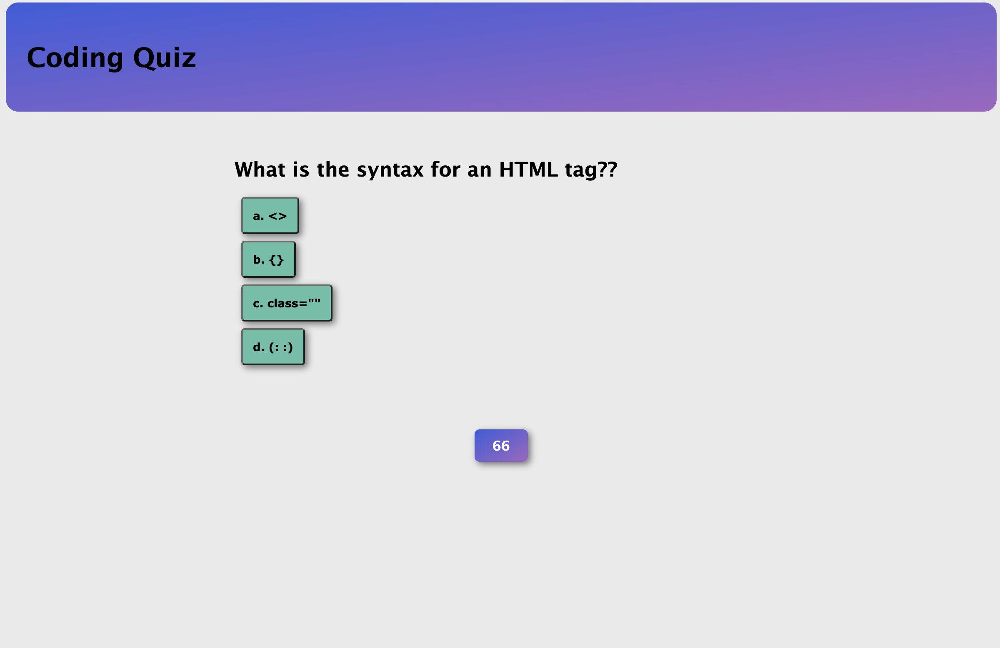

# Coding Quiz

The Coding Quiz project is a website I built that features a coding quiz where users can test their JavaScript knowledge in a timed a quiz. This quiz requires both knowledge and speed!

## Table of Contents

- [Description](#description)
- [Visuals](#visuals)
- [Support](#support)

## Description

The quiz features 5 simple questions. It is a 75-second timed quiz. When the right answer is clicked, the user proceeds the next question. When a wrong answer is clicked, a "Try Again" message displays, and 15 seconds are deducted from the timer. The game ends when all 5 questions are answered or when the timer hits 0. At the end of the quiz, users can save their initials and see recent scores to see how they performed compared to peers.

## Visuals

## Support

If you encounter any issues with the coding quiz, please reach out! My email is daniel.barto@gmail.com. Thank you!